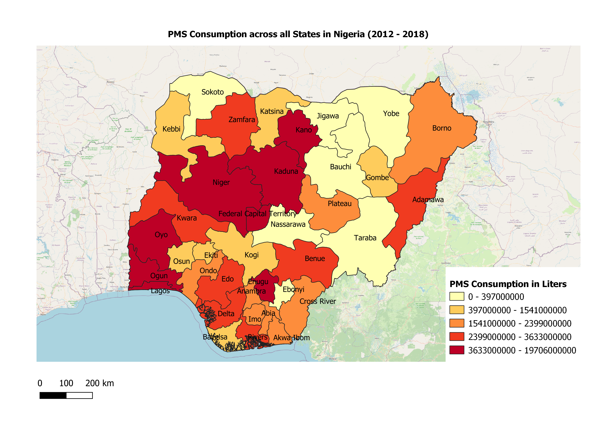
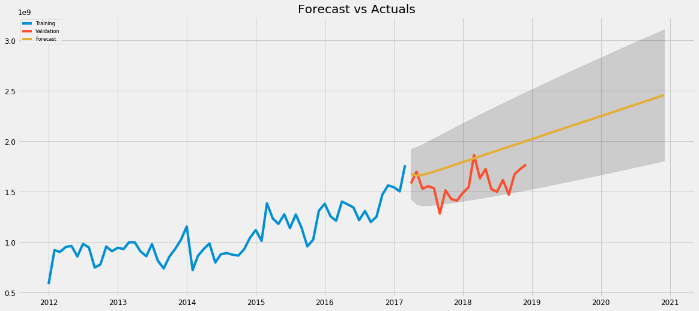
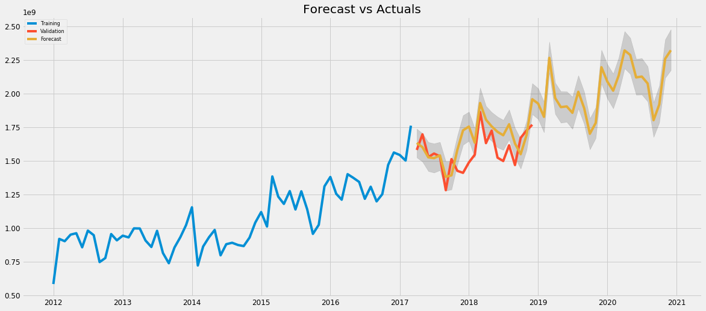

# Fuel Consumption Forecasting in Nigeria
Author: Adebayo Aonullahi

## Credits
**_Lead Researcher: Dr. Akeem Arinkoola (PhD.)_** 

## Description
The models were trained on PMS consumption data accross all states in Nigeria from 2012 to 2017 and validated with data in 2018. 

## Charts
**_Heat Map_**: 
 

**_ARIMA Model_**: 
 

**_Prophet Model_**: 
 
